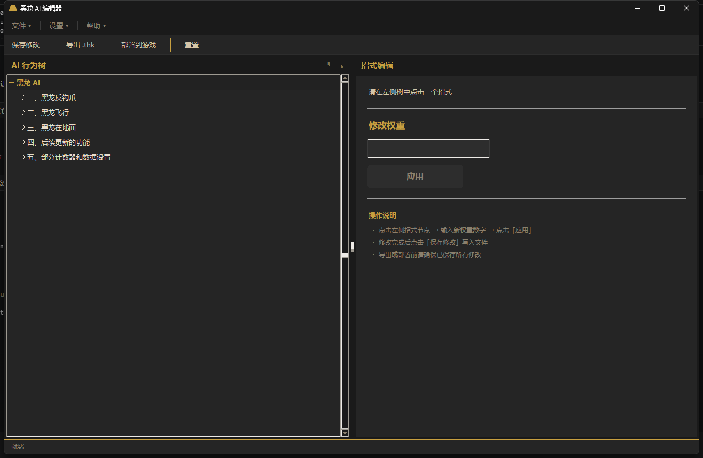

# 怪物猎人世界 · 黑龙 AI 编辑器

Monster Hunter World Fatalis AI Editor — a visual tool for editing the Fatalis (黑龙) monster AI behavior tree. Built-in Leviathon compiler supports one-click compilation and deployment.

## 功能 / Features

- 可视化黑龙行为树编辑（Visual behavior tree editing）
- 招式权重修改（Move weight adjustment）
- 计数器和阶段血量配置（Counter & HP threshold config）
- 内置编译器，一键导出 `.thk` 并部署到游戏目录
- 暗色 MH 主题 UI

## 截图 / Screenshots




## 快速开始 / Quick Start

### 直接使用（推荐）

下载 [Releases](../../releases) 中的 `fatalis_ai_editor.exe`，双击运行。**无需安装 Python 或任何依赖。**

### 从源码运行

```bash
pip install lark-parser construct regex sly pyinstaller
python src/fatalis_ai_editor.py
```

### 自行打包

```bash
pyinstaller --onefile --windowed \
  --add-data "data;data" \
  --hidden-import queue --hidden-import sly \
  --hidden-import lark --hidden-import construct \
  --hidden-import regex --collect-all sly \
  --exclude-module numpy --exclude-module mkl \
  --exclude-module cryptography --exclude-module lz4 \
  --exclude-module "ruamel.yaml" --exclude-module charset_normalizer \
  src/fatalis_ai_editor.py
```

## 目录 / Structure

```
├── src/                    # 源代码
│   ├── fatalis_ai_editor.py
│   ├── fatalis_ai_editor.spec
│   └── data/               # 内置编译器 + 怪物数据
└── release/                # 预编译免安装版
```

## 许可证 / License

GNU General Public License v3.0 — 本项目包含 [Leviathon](https://github.com/AsteriskAmpersand/Leviathon) 编译器的 GPL v3 代码。

## 声明 / Disclaimer

仅供研究学习使用，严禁用于竞速作弊。
